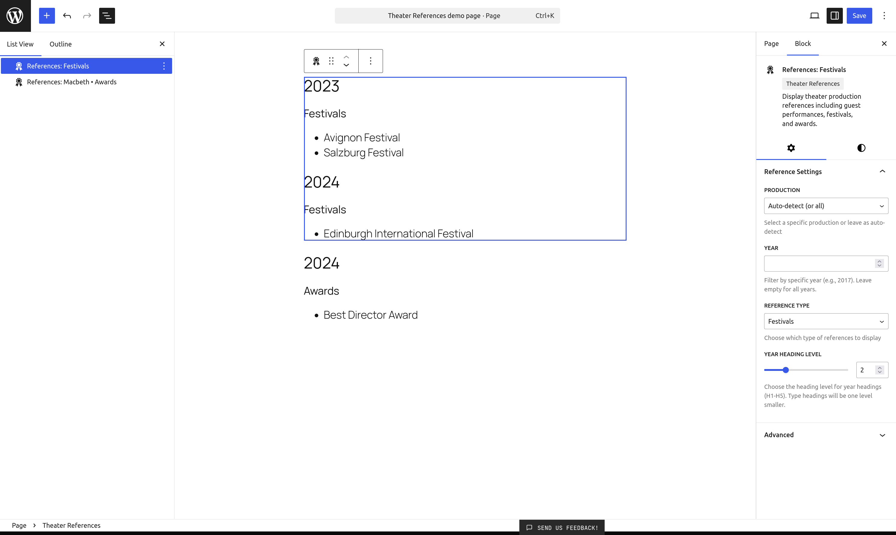
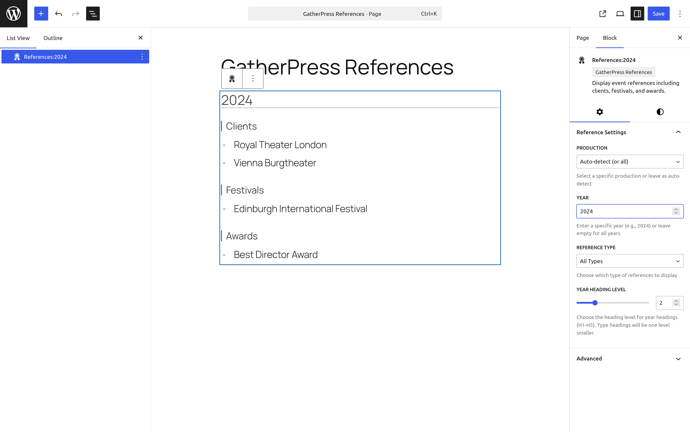

# GatherPress References

**Contributors:** carstenbach & WordPress Telex  
**Tags:** block, references, theater, events  
**Tested up to:** 6.8  
**Stable tag:** 0.1.0  
**Requires Plugins:**  gatherpress  
**License:** GPLv2 or later  
**License URI:** https://www.gnu.org/licenses/gpl-2.0.html  

[](https://playground.wordpress.net/?blueprint-url=https://raw.githubusercontent.com/carstingaxion/gatherpress-references/main/.wordpress-org/blueprints/blueprint.json)

Display references such as clients, festivals and awards in a structured, chronological format.

## Description

The **GatherPress References** block displays a generated list of references from past events. It automatically organizes references by year and type (e.g., clients, festivals, awards).

This plugin requires the GatherPress plugin to be installed and activated. It works with GatherPress events (`gatherpress_event` post type) to provide specialized reference management for theater productions and similar use cases.

Perfect for creating dynamic reference pages, portfolios, and annual summaries of achievements.

---

## Usage Examples

These examples demonstrate the plugin's flexibility across different use cases, from theater productions to conference management and blog organization.

### Default Theater Production Examples

The default configuration uses theater productions with clients, festivals, and awards. These examples work out-of-the-box after plugin activation.

<details>
<summary>Example 1: <strong>Show All References for a Specific Reference Term</strong></summary>

#### Use Case: **Production detail page showing all achievements**

**Settings:**
- Reference Term: Select specific term (e.g., *Hamlet* production)
- Year: Leave empty (all years)
- Reference Type: All Types  

**Result:** Displays all clients, festivals, and awards for that term across all years, organized chronologically.



---

</details>

<details>
<summary>Example 2: <strong>Annual Report Page</strong></summary>

#### Use Case: **Yearly summary of all activities**

**Settings:**
- Reference Term: All (or auto-detect)
- Year: Enter specific year (e.g., 2024)
- Reference Type: All Types

**Result:** Shows all references from 2024 regardless of reference term, grouped by type.



---

</details>

<details>
<summary>Example 3: <strong>Awards Page</strong></summary>

#### Use Case: **Dedicated page highlighting awards won**

**Settings:**
- Reference Term: All (or auto-detect)
- Year: Leave empty (all years)
- Reference Type: Awards  

**Result:** Lists all awards received across all reference terms and years, organized by year.


---

</details>

<details>
<summary>Example 4: <strong>Production Awards for Specific Year</strong></summary>

#### Use Case: **Show what a production achieved in a particular year**

**Settings:**
- Reference Term: Select specific term (e.g., *Macbeth* production)
- Year: Enter specific year (e.g., 2023)
- Reference Type: Awards

**Result:** Displays only awards that Macbeth received in 2023.


---

</details>

<details>
<summary>Example 5: <strong>Festival Participation History</strong></summary>

#### Use Case: **Portfolio page showing festival presence**

**Settings:**
- Reference Term: All (or auto-detect)
- Year: Leave empty
- Reference Type: Festivals  

**Result:** Complete chronological list of festival participations across all reference terms.


---

</details>

---

### GatherPress Built-in Taxonomies

Leverage GatherPress's native Topics and Venues taxonomies for powerful event organization and reference display.

<details>
<summary>Example 6: <strong>Conference Sessions by Topic and Venue</strong></summary>

#### Use Case: **Multi-track conference showcasing sessions organized by topic across different venues**

**Settings:**
- Reference Term: Select topic (e.g., "WordPress Development")
- Year: Leave empty (all conferences)
- Reference Type: Venues

**Result:** Shows all venues where WordPress Development sessions were held, organized by year. Perfect for conference retrospectives showing topic distribution across locations.

**Real-world Application:** A WordCamp network could use this to show:
- Which cities hosted specific topics
- Topic evolution across different venues over time
- Venue diversity for recurring conference topics

**Configuration Code:**
```php
add_action( 'registered_post_type_gatherpress_event', function() {
    $config = array(
        'ref_tax'   => 'gatherpress_topic',    // Main reference: Topics
        'ref_types' => array( 'gatherpress_venue' ), // Sub-reference: Venues
    );
    
    add_post_type_support( 'gatherpress_event', 'gatherpress_references', $config );
} );
```

---

</details>

<details>
<summary>Example 7: <strong>Venue Portfolio with Topic Distribution</strong></summary>

#### Use Case: **Showcase a venue's event history with topic variety**

**Settings:**
- Reference Term: Select venue (e.g., "Downtown Conference Center")
- Year: Leave empty (all years)
- Reference Type: Topics

**Result:** Displays all topics covered at the venue over time, organized chronologically. Shows the venue's versatility and event diversity.

**Real-world Application:** 
- Venue marketing: "We've hosted 50+ different event topics since 2018"
- Event planning: See what topics have been successful at specific venues
- Diversity reporting: Demonstrate topic breadth at your venue

**Configuration Code:**
```php
add_action( 'registered_post_type_gatherpress_event', function() {
    $config = array(
        'ref_tax'   => 'gatherpress_venue',    // Main reference: Venues
        'ref_types' => array( 'gatherpress_topic' ), // Sub-reference: Topics
    );
    
    add_post_type_support( 'gatherpress_event', 'gatherpress_references', $config );
} );
```

---

</details>

---

### Regular WordPress Posts

Extend the plugin beyond events to organize regular blog posts with WordPress's built-in taxonomies.

<details>
<summary>Example 8: <strong>Blog Post Archive by Category and Tags</strong></summary>

#### Use Case: **Create a dynamic reference guide of blog content organized by category with tag breakdowns**

**Settings:**
- Post Type: Post
- Reference Term: Select category (e.g., "Tutorials")
- Year: Leave empty (all years)
- Reference Type: Tags

**Result:** Shows all tags used in the Tutorials category, organized by publication year. Creates a visual taxonomy map of your content evolution.

**Real-world Application:**
- Content audit: See which tags were popular each year
- Editorial planning: Identify gaps in tag coverage
- Reader navigation: "See all tutorial topics we've covered since 2020"

**Configuration Code:**
```php
add_action( 'init', function() {
    $config = array(
        'ref_tax'   => 'category',              // Main reference: Categories
        'ref_types' => array( 'post_tag' ),     // Sub-reference: Tags
    );
    
    add_post_type_support( 'post', 'gatherpress_references', $config );
}, 20 );
```

---

</details>

<details>
<summary>Example 9: <strong>Multi-Author Blog Tag Distribution</strong></summary>

#### Use Case: **Author portfolio page showing their topic expertise through tags**

**Settings:**
- Post Type: Post
- Reference Term: Select author
- Year: 2024
- Reference Type: Tags

**Result:** Shows all tags the author wrote about in 2024, demonstrating their expertise areas and content focus for that year.

**Real-world Application:**
- Author bio pages: "Topics I've covered this year"
- Editorial analytics: Track author specialization over time
- Guest author portfolios: Showcase contribution breadth

**Configuration Code:**
```php
// First, register a custom 'author' taxonomy for better organization
function register_author_taxonomy() {
    register_taxonomy( 'blog_author', 'post', array(
        'labels' => array(
            'name' => 'Authors',
            'singular_name' => 'Author',
        ),
        'hierarchical' => true,
        'show_in_rest' => true,
        'public' => true,
    ));
}
add_action( 'init', 'register_author_taxonomy' );

// Configure references
add_action( 'init', function() {
    $config = array(
        'ref_tax'   => 'blog_author',           // Main reference: Authors
        'ref_types' => array( 'post_tag', 'category' ), // Topics & Categories
    );
    
    add_post_type_support( 'post', 'gatherpress_references', $config );
}, 20 );
```

---

</details>

---

### Creative Advanced Use Cases

<details>
<summary>Example 10: <strong>Recipe Blog - Cuisine Types and Dietary Tags</strong></summary>

#### Use Case: **Food blog organizing recipes by cuisine with dietary restriction filters**

**Settings:**
- Reference Term: "Italian"
- Year: Leave empty
- Reference Type: Dietary

**Result:** Shows all dietary variations of Italian recipes (Vegan, Gluten-Free, etc.) organized by year published. Helps readers find dietary-appropriate recipes within their favorite cuisines.

**Real-world Application:**
- Recipe filtering: "All our vegan Italian recipes since 2020"
- Content diversity: Show dietary inclusivity across cuisines
- Meal planning: "Italian breakfast, lunch, and dinner options"

**Configuration Code:**
```php
// Register custom taxonomies
function register_recipe_taxonomies() {
    // Cuisine taxonomy (hierarchical)
    register_taxonomy( 'cuisine', 'post', array(
        'labels' => array(
            'name' => 'Cuisines',
            'singular_name' => 'Cuisine',
        ),
        'hierarchical' => true,
        'show_in_rest' => true,
    ));
    
    // Dietary restrictions (non-hierarchical)
    register_taxonomy( 'dietary', 'post', array(
        'labels' => array(
            'name' => 'Dietary Tags',
            'singular_name' => 'Dietary Tag',
        ),
        'hierarchical' => false,
        'show_in_rest' => true,
    ));
    
    // Meal type
    register_taxonomy( 'meal_type', 'post', array(
        'labels' => array(
            'name' => 'Meal Types',
            'singular_name' => 'Meal Type',
        ),
        'hierarchical' => false,
        'show_in_rest' => true,
    ));
}
add_action( 'init', 'register_recipe_taxonomies' );

// Configure references
add_action( 'init', function() {
    $config = array(
        'ref_tax'   => 'cuisine',               // Main: Cuisine type
        'ref_types' => array( 'dietary', 'meal_type' ), // Dietary & Meal types
    );
    
    add_post_type_support( 'post', 'gatherpress_references', $config );
}, 20 );
```

---

</details>

<details>
<summary>Example 11: <strong>E-Learning Platform - Courses by Topic and Skill Level</strong></summary>

#### Use Case: **Educational site showcasing course progression and topic breadth**

**Settings:**
- Post Type: Course
- Reference Term: "JavaScript"
- Year: Leave empty
- Reference Type: Skill Levels

**Result:** Shows the learning path for JavaScript courses - Beginner, Intermediate, Advanced - organized by when courses were published. Demonstrates curriculum evolution.

**Real-world Application:**
- Course catalog: "Our JavaScript curriculum has grown from 3 beginner courses in 2020 to 15 courses across all levels"
- Student guidance: See available skill progressions for topics
- Instructor metrics: Show teaching breadth across levels and topics

**Configuration Code:**
```php
// Register custom post type and taxonomies
function register_course_types() {
    // Course post type
    register_post_type( 'course', array(
        'labels' => array(
            'name' => 'Courses',
            'singular_name' => 'Course',
        ),
        'public' => true,
        'has_archive' => true,
        'show_in_rest' => true,
        'supports' => array( 'title', 'editor', 'thumbnail' ),
    ));
    
    // Topic taxonomy
    register_taxonomy( 'course_topic', 'course', array(
        'labels' => array(
            'name' => 'Course Topics',
            'singular_name' => 'Course Topic',
        ),
        'hierarchical' => true,
        'show_in_rest' => true,
    ));
    
    // Skill level
    register_taxonomy( 'skill_level', 'course', array(
        'labels' => array(
            'name' => 'Skill Levels',
            'singular_name' => 'Skill Level',
        ),
        'hierarchical' => false,
        'show_in_rest' => true,
    ));
    
    // Instructor
    register_taxonomy( 'instructor', 'course', array(
        'labels' => array(
            'name' => 'Instructors',
            'singular_name' => 'Instructor',
        ),
        'hierarchical' => false,
        'show_in_rest' => true,
    ));
}
add_action( 'init', 'register_course_types' );

// Configure references
add_action( 'registered_post_type_course', function() {
    $config = array(
        'ref_tax'   => 'course_topic',          // Main: Course topics
        'ref_types' => array( 'skill_level', 'instructor' ),
    );
    
    add_post_type_support( 'course', 'gatherpress_references', $config );
});
```

---

</details>

<details>
<summary>Example 12: <strong>Podcast Network - Shows by Category and Guest Appearances</strong></summary>

#### Use Case: **Podcast network showcasing show diversity and notable guest appearances**

**Settings:**
- Reference Term: "Tech Talk Tuesday"
- Year: 2024
- Reference Type: Guests

**Result:** Shows all guests who appeared on Tech Talk Tuesday in 2024, organized chronologically. Great for show marketing and guest prospecting.

**Real-world Application:**
- Show promotion: "We've featured 50+ industry leaders in 2024"
- Guest outreach: "Join names like [Previous Guest List]"
- Audience discovery: Browse guests by genre across shows
- Network analytics: Show guest diversity across the network

**Configuration Code:**

```php
// Register podcast taxonomies
function register_podcast_taxonomies() {
    register_taxonomy( 'podcast_show', 'post', array(
        'labels' => array(
            'name' => 'Podcast Shows',
            'singular_name' => 'Podcast Show',
        ),
        'hierarchical' => true,
        'show_in_rest' => true,
    ));
    
    register_taxonomy( 'podcast_guest', 'post', array(
        'labels' => array(
            'name' => 'Podcast Guests',
            'singular_name' => 'Podcast Guest',
        ),
        'hierarchical' => false,
        'show_in_rest' => true,
    ));
    
    register_taxonomy( 'podcast_genre', 'post', array(
        'labels' => array(
            'name' => 'Podcast Genres',
            'singular_name' => 'Podcast Genre',
        ),
        'hierarchical' => false,
        'show_in_rest' => true,
    ));
}
add_action( 'init', 'register_podcast_taxonomies' );

// Configure references
add_action( 'init', function() {
    $config = array(
        'ref_tax'   => 'podcast_show',          // Main: Show name
        'ref_types' => array( 'podcast_guest', 'podcast_genre' ),
    );
    
    add_post_type_support( 'post', 'gatherpress_references', $config );
}, 20 );
```

---

</details>

---

## Filter Combinations Matrix

This matrix shows all possible filter combinations and their expected behaviors:

| # | Reference Term | Year     | Type     | Expected Result                                      |
|---|----------------|----------|----------|-----------------------------------------------------|
| 1 | Any/All        | All      | All      | Show all events, all types (no filters)             |
| 2 | Specific       | All      | All      | Show events for reference term, all types           |
| 3 | Specific       | All      | Specific | Show events for reference term with specific type   |
| 4 | Any/All        | All      | Specific | Show all events with specific type                  |
| 5 | Any/All        | Specific | All      | Show all events from year, all types                |
| 6 | Specific       | Specific | All      | Show reference term events from year, all types     |
| 7 | Specific       | Specific | Specific | Show reference term events from year with specific type |
| 8 | Any/All        | Specific | Specific | Show all events from year with specific type        |

**Filter Logic:**

- All filters use **AND** logic when combined  
- **Any/All** for Reference Term means no term filter is applied  
- **All** for Type means no type filter is applied  
- **All** for Year means no year filter is applied  

---

## Installation

1. **Install and activate GatherPress plugin first** (required dependency)
2. Upload the plugin files to the `/wp-content/plugins/gatherpress-references` directory.
3. Activate the plugin through the **Plugins** screen in WordPress.
4. The plugin will register custom taxonomies based on configuration (by default: Productions, Clients, Festivals, and Awards).
5. Add terms to these taxonomies via the **Events** admin menu.
6. Assign taxonomy terms to event posts.
7. Insert the block into any post or template.
8. Use the block settings to filter by reference term, year, or reference type.

---

## Frequently Asked Questions

### Does this plugin work without GatherPress?

No, this plugin is specifically designed as a GatherPress add-on and requires GatherPress to be installed and activated. It extends GatherPress functionality to add reference management.

### What taxonomies does this plugin create?

By default, the plugin registers four custom taxonomies associated with the GatherPress `gatherpress_event` post type:
- `gatherpress-production`: Hierarchical taxonomy for productions (the default reference taxonomy)
- `_gatherpress-client`: Clients
- `_gatherpress-festival`: Festival participations
- `_gatherpress-award`: Awards received

These work alongside GatherPress's existing event taxonomies and can be customized via post type support configuration.

### Can I use this plugin with regular WordPress posts?

Yes! While designed for GatherPress events, the plugin works with any post type. Add support using `add_post_type_support()` with your desired taxonomies. See Example 8 and 9 for complete code examples.

### Can I use GatherPress's built-in taxonomies (Topics and Venues)?

Absolutely! Examples 6 and 7 show how to leverage GatherPress's native Topics and Venues taxonomies for powerful event organization and reference displays.

### Can I show only awards for a specific production?

Yes. Use the block settings to select a specific production and set the type filter to **Awards**.

### Does it work automatically on reference term archive pages?

Yes. When placed on a reference taxonomy term archive, the block automatically detects the term context and shows only its references.

### How do I customize the block's appearance?

The block supports **theme.json** styling:

- Colors (background, text, links)  
- Typography (font family, size, line height)  
- Spacing (margin, padding, block gap)  
- Borders (color, radius, width)  

You can also use custom CSS:

- `.wp-block-gatherpress-references` - Main container
- `.references-year` - Year headings
- `.references-type` - Type headings
- `.references-list` - Reference lists

### Can I change the heading levels?

Yes. The block includes a **Year Heading Level** control in the block settings. You can set year headings to **H1–H5**, and type headings will automatically be one level smaller.

### Can I change the year sort order?

Yes. The block includes a **Sort Years** toggle control. By default, years are sorted newest first (descending). Toggle it on to sort from oldest to newest (ascending). This control only appears when showing all years (no specific year filter).

### How do I add demo data for testing?

The Playground contains a [Demo Data Generator](https://gist.github.com/carstingaxion/fd8b833d935f69b23e6a081b12a5937a), that can be used to create a bunch of real data to test the plugin.

Go to **Events → Demo Data** in the WordPress admin and click **Generate Demo Data** to create:

- 5 theater productions  
- 20 GatherPress event posts  
- 8 client terms  
- 6 festival terms  
- 6 award terms  

All demo data is marked for easy cleanup via the **Delete Demo Data** button.

### Does this affect my existing GatherPress events?

No, this plugin only adds optional taxonomies to GatherPress events. Your existing events remain unchanged unless you explicitly assign the new taxonomy terms to them.

---

## Screenshots

1. Show All References for a Specific Production
2. Annual Report Page
3. Awards Page
4. Production Awards for Specific Year
5. Festival Participation History

---

## Developer Documentation

### GatherPress Integration

The plugin extends GatherPress by registering taxonomies and using post type support for configuration:

```php
// Configure which taxonomies to use via post type support
$config = array(
    'ref_tax'   => 'gatherpress-production',  // The main reference taxonomy
    'ref_types' => array( '_gatherpress-client', '_gatherpress-festival', '_gatherpress-award' ),
);
add_post_type_support( 'gatherpress_event', 'gatherpress_references', $config );
```

### Block Attributes

```json
{
  "refTermId": {
    "type": "number",
    "default": 0
  },
  "year": {
    "type": "number",
    "default": 0
  },
  "referenceType": {
    "type": "string",
    "default": "all",
    "enum": ["all", "ref_client", "ref_festival", "ref_award"]
  },
  "headingLevel": {
    "type": "number",
    "default": 2
  },
  "yearSortOrder": {
    "type": "string",
    "default": "desc",
    "enum": ["asc", "desc"]
  }
}
```

### Caching Strategy

The plugin uses WordPress transients for performance:

```php
// Cache key based on filter parameters
$cache_key = 'gatherpress_refs_' . md5(serialize([
    $ref_term_id,
    $year,
    $type
]));

// Try to get cached data
$cached = get_transient($cache_key);
if (false !== $cached) {
    return $cached;
}

// ... perform query ...

// Cache results for 1 hour
set_transient($cache_key, $references, 3600);
```

**Cache Invalidation:**
Cache is automatically cleared when:
- Event posts are saved or deleted
- Taxonomy terms are edited or deleted
- Demo data is generated or deleted

### Data Organization

Results are organized and cached in a nested structure:

```php
[
    '2024' => [
        '_gatherpress-client' => ['Client 1', 'Client 2'],
        '_gatherpress-festival' => ['Festival 1'],
        '_gatherpress-award' => ['Award 1', 'Award 2']
    ],
    '2023' => [
        '_gatherpress-client' => ['Client 3'],
        '_gatherpress-festival' => [],
        '_gatherpress-award' => ['Award 3']
    ]
]
```

### Filter Hooks Reference

The plugin provides several filter hooks for customization:

#### `gatherpress_references_cache_expiration`

**Description:** Modify the cache expiration time in seconds.

**Default:** 3600 (1 hour)

**Parameters:**
- `$seconds` (int) - Cache expiration time in seconds

**Example - Increase cache to 2 hours:**
```php
add_filter( 'gatherpress_references_cache_expiration', function( $seconds ) {
    return 7200; // 2 hours
} );
```

**Example - Disable caching:**
```php
add_filter( 'gatherpress_references_cache_expiration', '__return_zero' );
```

---

#### `gatherpress_references_query_args`

**Description:** Modify WP_Query arguments before the query is executed.

**Parameters:**
- `$args` (array) - WP_Query arguments array
- `$ref_term_id` (int) - Reference term ID filter
- `$year` (string) - Year filter
- `$type` (string) - Reference type filter

**Example - Limit results to 50 posts:**
```php
add_filter( 'gatherpress_references_query_args', function( $args ) {
    $args['posts_per_page'] = 50;
    return $args;
} );
```

**Example - Add custom meta query:**
```php
add_filter( 'gatherpress_references_query_args', function( $args ) {
    $args['meta_query'] = array(
        array(
            'key'     => 'featured',
            'value'   => '1',
            'compare' => '='
        )
    );
    return $args;
} );
```

**Example - Conditional ordering:**
```php
add_filter( 'gatherpress_references_query_args', function( $args, $ref_term_id, $year, $type ) {
    // Order by title alphabetically for award references
    if ( $type === '_gatherpress-award' ) {
        $args['orderby'] = 'title';
        $args['order'] = 'ASC';
    }
    return $args;
}, 10, 4 );
```

---

#### `gatherpress_references_type_labels`

**Description:** Customize the human-readable labels for each reference type displayed in headings.

**Default:**
```php
array(
    '_gatherpress-client'    => __( 'Clients', 'gatherpress-references' ),
    '_gatherpress-festival' => __( 'Festivals', 'gatherpress-references' ),
    '_gatherpress-award'    => __( 'Awards', 'gatherpress-references' ),
)
```

**Parameters:**
- `$labels` (array) - Array of taxonomy slug => label pairs

**Example - Override existing label:**
```php
add_filter( 'gatherpress_references_type_labels', function( $labels ) {
    $labels['_gatherpress-award'] = __( 'Prizes & Honours', 'textdomain' );
    return $labels;
} );
```

**Example - Locale-specific labels:**
```php
add_filter( 'gatherpress_references_type_labels', function( $labels ) {
    $locale = get_locale();
    
    if ( $locale === 'de_DE' ) {
        $labels['_gatherpress-client'] = 'Gastspiele & Kunden';
        $labels['_gatherpress-festival'] = 'Festivals';
        $labels['_gatherpress-award'] = 'Auszeichnungen';
    }
    
    return $labels;
} );
```

### Performance Considerations

1. **Batch Queries**: Use `get_post_dates()` and `get_post_terms()` to minimize database calls
2. **Field Limitation**: Query only post IDs with `'fields' => 'ids'`
3. **Cache Management**: Automatic transient caching with smart invalidation
4. **No Found Rows**: Set `'no_found_rows' => true` to skip pagination count
5. **Term Cache**: Enable term caching with `'update_post_term_cache' => true`

### Theme.json Integration

The block fully supports WordPress theme.json:

```json
{
    "settings": {
        "blocks": {
            "gatherpress/references": {
                "color": {
                    "palette": [
                        {
                            "name": "Primary",
                            "slug": "primary",
                            "color": "#your-color"
                        }
                    ]
                },
                "typography": {
                    "fontSizes": [
                        {
                            "name": "Year Heading",
                            "slug": "year-heading",
                            "size": "2.5rem"
                        }
                    ]
                },
                "spacing": {
                    "padding": true,
                    "margin": true,
                    "blockGap": true
                }
            }
        }
    }
}
```

## Changelog

All notable changes to this project will be documented in the [CHANGELOG.md](CHANGELOG.md).
